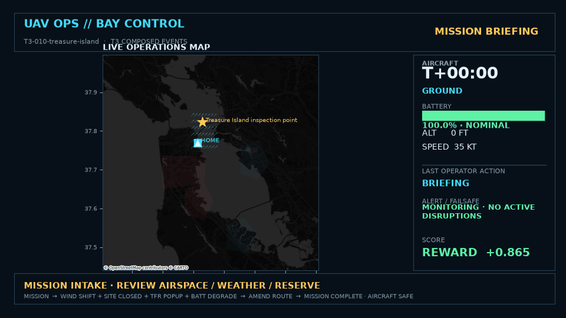
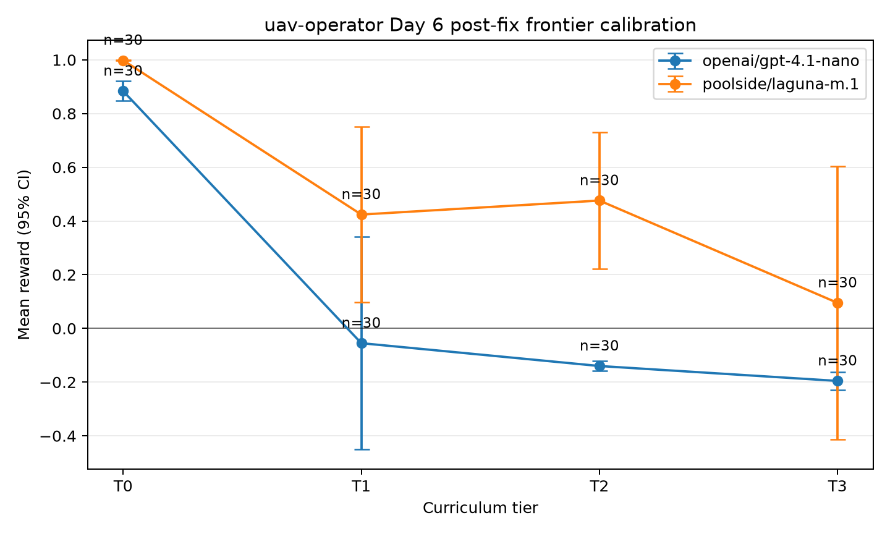
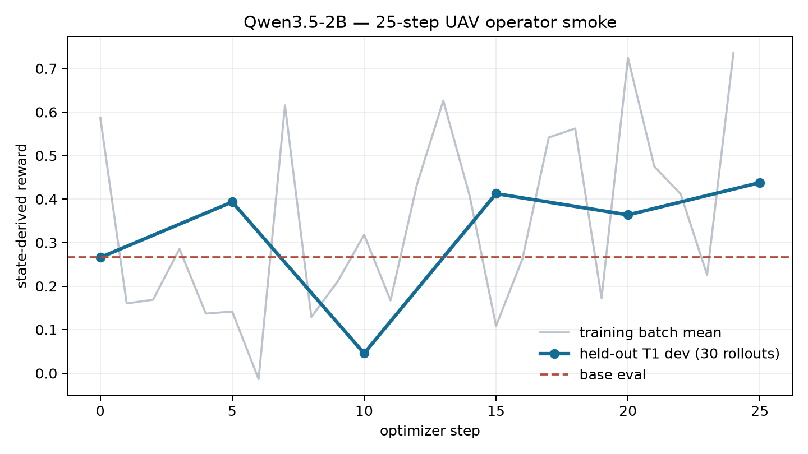

# uav-operator

`uav-operator` is a multi-turn reinforcement-learning environment for
supervisory drone operations. An LLM acts as the remote pilot in command for
small-UAS missions over the San Francisco Bay Area, responding to shifting
wind, pop-up flight restrictions, battery anomalies, lost-link events, and
mission updates.

Drones already fly themselves. The simulator's autopilot follows routes, holds
altitude, executes return-to-launch, and applies simple failsafes. The model is
tested on the layer above classical control: deciding whether to continue,
reroute, hold, recover, override, or abort as conditions change.

Every reward is computed from logged simulator state. The model's prose cannot
claim success, excuse a violation, or otherwise affect its score.



## What the model controls

| Model: operational judgment | Autopilot and simulator: aircraft execution |
| --- | --- |
| Query telemetry, weather, airspace, sites, and mission status | Fly filed waypoint routes analytically |
| File or amend a route | Hold commanded altitude and airspeed |
| Choose holds, recovery sites, RTL, landing, or mission abort | Advance directly between operational decision points |
| Release payload and acknowledge alerts | Apply wind, energy use, and seeded event effects |
| Override a failsafe with a structured justification | Trigger and execute simple built-in failsafes |

The action space deliberately excludes stick-level control and trajectory
micro-corrections. This is an event-driven operations simulator, not a flight
dynamics integrator.

## Quickstart

Install the published environment from the Prime Intellect Hub:

```bash
prime --plain env install jarrett/uav-operator@0.1.1 --prerelease
```

Run a two-episode evaluation:

```bash
prime --plain eval run uav-operator -n 2 -r 1 --disable-tui
```

`--prerelease` is required for installation because version `0.1.1` depends on
a development release of Verifiers.

For a source checkout:

```bash
uv sync --locked --all-groups
uv run pytest -q
prime --plain eval run uav-operator -n 2 -r 1 --skip-upload --disable-tui
```

See [Development](docs/DEVELOPMENT.md) for local checks, evaluation options,
baselines, calibration, world-data rebuilding, and renderer dependencies.

## Scenario curriculum

The generated dataset contains 300 train, 60 development/calibration, and 60
held-out evaluation examples. Each split uses a disjoint deterministic seed
range and is stratified across four tiers.

| Tier | Operational shape | What it tests |
| --- | --- | --- |
| T0 | One mission, no interrupts, generous margins | Harness sanity and basic tool use |
| T1 | One seeded event with a rulebook-style response | Parsing, procedure, and timely action |
| T2 | One or two interacting events | Judgment when a naive response loses mission value |
| T3 | Two to four composed events and tight margins | Tradeoffs across safety, energy, airspace, and mission goals |

T2 and T3 scenarios pass an analytic feasibility check before admission. The
generator ensures that at least one safe route or recovery response exists; it
does not guarantee that the original mission remains completable.

## State-only reward

The final scalar reward is the sum of five equally weighted components. Every
component reads the final and historical snapshots in `state["sim_log"]`;
none reads prompts, assistant messages, tool-call prose, or the final answer.

| Component | Signal |
| --- | --- |
| `mission_value` | Mission completion with briefed timeliness decay |
| `hard_safety` | Aircraft loss, critical airborne battery outcomes, and airspace incursions |
| `margin_policy` | Landing reserve, unsafe overrides, and minimum-safe-altitude violations |
| `procedure` | Unacknowledged alerts, known-conflict filing, and expired holds |
| `efficiency` | Energy and simulated-time cost relative to scenario par |

This makes natural-language claims inert: success must appear in the physical
and procedural trajectory.

## Determinism and replay

For a fixed seed and action sequence, the simulator produces the same outcome.
All randomness flows through one episode-local NumPy generator, including wind
perturbations, gust fronts, and scenario events. There is no wall-clock or
unseeded sampling in simulator state transitions.

The simulator advances from decision point to decision point using analytic
segment time, energy, event, and failsafe calculations. Every decision appends
a full serializable snapshot to `sim_log`, which is the sole interface used by
reward functions, saved evidence, red-team checks, and the offline renderer.

The frozen rollout format is documented in [Rollout schema](docs/SCHEMA.md).

## Calibration evidence



The post-fix calibration uses the same development split and fixed sampling for
both models: 15 examples per tier, two rollouts per example, and zero provider
errors across all 240 rollouts.

| Model | Tier | Mean reward | Missions completed | Hard-safety outcomes |
| --- | --- | ---: | ---: | ---: |
| GPT-4.1-nano | T0 | 0.884 | 30/30 | 0 |
| GPT-4.1-nano | T1 | -0.055 | 6/30 | 1 |
| GPT-4.1-nano | T2 | -0.140 | 0/30 | 0 |
| GPT-4.1-nano | T3 | -0.196 | 0/30 | 0 |
| Laguna | T0 | 0.998 | 30/30 | 0 |
| Laguna | T1 | 0.424 | 22/30 | 0 |
| Laguna | T2 | 0.476 | 29/30 | 0 |
| Laguna | T3 | 0.095 | 26/30 | 2 |

GPT-4.1-nano provides a weak monotonic reference: near-ceiling performance on
T0 falls below zero on the event tiers. Laguna remains strong through T2, then
drops sharply on T3 and records two hard-safety outcomes. This is calibration
evidence that the implemented tiers separate model capability, not a trained
model leaderboard.

Confidence intervals, turn counts, run provenance, result paths, and exact
model identifiers are retained in the
[machine-readable calibration artifact](assets/evals/day6_frontier_calibration.json).

## Offline renderer

Render any saved rollout that contains the frozen `sim_log` schema:

```bash
uv run python scripts/render.py \
  assets/rollouts/day7/laguna-t3-treasure-island-safe-response.json \
  -o out.mp4
```

For a fully offline vector map with no tile access:

```bash
uv run python scripts/render.py \
  assets/rollouts/day7/laguna-t3-treasure-island-safe-response.json \
  -o out.mp4 --no-basemap
```

The renderer consumes the artifact directly; it does not import, instantiate,
or replay the live simulator. Additional examples are available in the
[five-episode contact sheet](assets/renders/day7/contact-sheet.png).

## Status and limitations

The environment, deterministic dataset generator, state-only reward, T0–T3
calibration workflow, red-team checks, Hub installation, saved-state
evaluation, and offline rendering path are implemented. The simulator is an
analytic supervisory-operations abstraction, not high-fidelity aerodynamics,
vehicle control, or legal airspace guidance.

A paid 25-step Qwen3.5-2B LoRA GRPO smoke completed with zero provider errors
and retained READY checkpoints at steps 15 and 20. Its held-out T1 development
reward rose from 0.2660 at the base evaluation to 0.4379 at step 25, but the
curve is noisy and final truncation reached 26.7%. This is genuine training
evidence, not yet a demonstrated stable or broader learned improvement.



The exact run metadata, complete platform metrics, token usage, pricing, and
checkpoint records are in the
[machine-readable smoke artifact](assets/training/day8_qwen35_2b_t1_smoke_25.json).
Captured checkpoint evaluation on identical frozen T1 dev seeds selected step
20 over step 15 by the preregistered safety-first rule: both had zero hard
safety violations, while step 20 improved mean reward from 0.4065 to 0.4899,
completions from 16/30 to 19/30, and max-turn truncations from 11/30 to 8/30.
The two evaluations cost $0.3285 and $0.2968 ($0.6253 combined). The validated
[selection JSON](assets/training/day8_qwen35_2b_t1_checkpoint_selection.json)
and [comparison plot](assets/training/day8_qwen35_2b_t1_checkpoint_selection.png)
preserve the decision and paired-seed deltas. Earlier free-model failures
remain in the historical [training status report](docs/DAY8_FREE_TRAINING.md).

## Documentation

- [Configuration](docs/CONFIGURATION.md): implemented loader settings, split
  behavior, ownership, and evaluation TOML.
- [Development](docs/DEVELOPMENT.md): setup, checks, local runs, baselines,
  calibration, retries, world data, and rendering.
- [Specification](SPEC.md): simulator, actions, scenarios, and reward design.
- [Reward-hacking notes](docs/HACKS.md): adversarial probes and closed
  exploits.
- [Rollout schema](docs/SCHEMA.md): frozen offline artifact contract.

The Hub wheel intentionally contains only `uav_operator.py` and
`pyproject.toml`. Scripts, documentation, media, and evidence remain in the
source repository.
