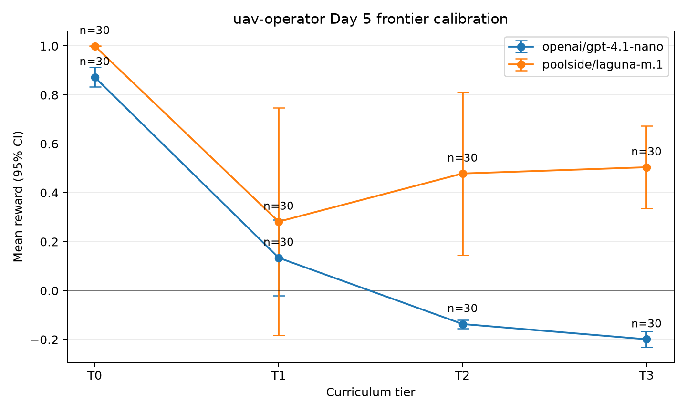

# uav-operator

`uav-operator` is a multi-turn Prime Intellect / Verifiers environment where
an LLM acts as the remote pilot in command for small UAS missions over the San
Francisco Bay Area.

Drones already fly themselves. Autopilots hold trajectories, execute return to
launch, and enforce simple failsafes. This environment tests the layer above
that: ops-center judgment under shifting wind, pop-up flight restrictions,
battery anomalies, lost-link events, and mission updates. The simulator owns
the aircraft and every reward is computed from logged simulator state, not from
the model's prose.

### Overview
- **Environment ID**: `uav-operator`
- **Short description**: Multi-turn UAV operations environment with
  physics-derived rewards and tool-based operator decisions.
- **Tags**: `uav`, `drone-operations`, `multi-turn`, `tool-use`, `train`,
  `eval`
- **Status**: Day 5 complete: seeded T0-T3 generation, composed-event
  feasibility checks, a 300/60/60 train/dev/final-eval split, loop-regression
  pricing with structured ground-stall warnings, TFR-preserving
  outbound/recovery solver admission, scripted calibration, deterministic sim
  logging, canonical hard-safety outcome scoring, the full SPEC §3.2 console,
  and a clean GPT-4.1-nano frontier calibration curve. Day 6 red-team round 1
  is next.

### Datasets
- **Primary dataset(s)**: Seeded scenario generator emitting T0-T3 examples.
- **Source links**: Static Day 2 world data is generated in-repo with
  `scripts/build_world.py` from simplified public-structure airspace and
  synthetic obstacle assumptions.
- **Current split sizes**: 300 train, 60 dev/calibration, and 60 final eval
  rows. Each split is stratified evenly across T0-T3; final-eval seeds are
  never used for dial calibration.

### Task
- **Type**: Multi-turn tool use.
- **Role**: Remote pilot in command / ops-center operator.
- **Model decisions**: File or amend plans, query telemetry/weather/airspace,
  hold, resume, return to launch, land, release payload, abort missions, and
  override simulator-owned failsafes when justified by the scenario state.
- **Rubric overview**: Mission value, hard safety violations, reserve and
  margin policy, procedural compliance, and efficiency. Reward components read
  only saved `sim_log` snapshots; model prose is inert.

### Quickstart
Clone the repository and create the complete runtime and development
environment from the locked `pyproject.toml` dependency set:

```bash
uv sync --locked --all-groups
uv run ruff check .
uv run pytest -q
```

Run a small local smoke evaluation:

```bash
prime --plain eval run uav-operator -n 2 -r 1 --skip-upload --disable-tui
```

Configure model, sampling, and saved simulator state:

```bash
prime --plain eval run uav-operator \
  -m poolside/laguna-m.1 \
  -n 5 \
  -r 1 \
  -t 512 \
  -T 0.2 \
  --skip-upload \
  --disable-tui \
  --save-results \
  --state-columns sim_state,sim_log
```

Notes:
- Put task-owned settings under `[env.taskset]` and harness-owned settings
  under `[env.harness]` in TOML configs.
- The core sim is event-driven and analytic. It tests supervisory operator
  judgment, not low-level flight control or 3D collision physics.
- Inspect or rebuild the static Day 2 world JSON with
  `uv run python scripts/build_world.py`.
- Inspect the deterministic scripted rollout artifact at
  `assets/rollouts/day3_scripted_rollout.json`.
- Run local baselines with
  `uv run python scripts/baselines.py --policy both --episodes 20 --tier all`.
- Run Day 5 scripted calibration with
  `uv run python scripts/day5_calibration.py`. Build a frontier plot by passing
  saved `vf-eval` run directories to `scripts/plot_day5_scores.py`.
- Run each final frontier tier with fixed sampling, for example:
  `prime --plain eval run uav-operator -m poolside/laguna-m.1 -n 15 -r 2 -t 512 -T 0.2 --save-results --state-columns sim_state,sim_log`.
  Repeat for `gpt-5-nano` and record the printed run ID/results path; use taskset
  tier overrides for `T0` through `T3`.

### Day 5 calibration



The calibration compares GPT-4.1-nano and Laguna on the same dev split with
fixed sampling, 30 rollouts per tier, and no provider errors. Error bars are
95% normal confidence intervals over rollout rewards; `n` is annotated on
every point.

| Model | Tier | Mean reward | 95% CI | Missions completed | Run ID |
| --- | --- | ---: | ---: | ---: | --- |
| GPT-4.1-nano | T0 | 0.872 | [0.832, 0.912] | 30/30 | `6d18e4bc` |
| GPT-4.1-nano | T1 | 0.134 | [-0.020, 0.288] | 7/30 | `f2cef9f9` |
| GPT-4.1-nano | T2 | -0.137 | [-0.154, -0.119] | 0/30 | `ea07497e` |
| GPT-4.1-nano | T3 | -0.199 | [-0.231, -0.167] | 0/30 | `ef609452` |
| Laguna | T0 | 1.000 | [0.999, 1.000] | 30/30 | `bb684c4c` |
| Laguna | T1 | 0.282 | [-0.183, 0.747] | 22/30 | `1c757714` |
| Laguna | T2 | 0.479 | [0.146, 0.811] | 28/30 | `99ecf01b` |
| Laguna | T3 | 0.504 | [0.335, 0.673] | 27/30 | `t3-clean-retry` |

GPT-4.1-nano shows the intended monotonic difficulty curve: T0 is near ceiling,
T1 is materially harder, and T2/T3 fall below zero as composed interrupts and
turn-cap failures increase. Laguna is near ceiling on T0 and substantially
stronger on T2/T3, but its high-variance T1 result makes its curve non-monotonic.
That model-specific interaction is calibration evidence to investigate rather
than hide. All 240 plotted rollouts are free of provider errors and hard-safety
violations. The machine-readable results and provenance are in
[`assets/evals/day5_frontier_calibration.json`](assets/evals/day5_frontier_calibration.json).

### Taskset Config
Planned fields:

| Field | Type | Default | Description |
| --- | ---- | ------- | ----------- |
| `tier` | string | `mixed_day5` | Scenario tier: `T0`–`T3`, `mixed_day5`, or legacy `mixed_day4`. |
| `dataset_split` | string | internal | Generated split: 300 train rows, 60 dev rows for scripts, or 60 held eval rows. |
| `seed` | int | `0` | Base seed for deterministic scenario generation. |
| `max_examples` | int | `-1` | Limit on dataset size; use `-1` for all generated examples. |
| `wind_enabled` | bool | `true` | Enable seeded Day 3 wind field and altitude shear. |
| `gust_front_probability` | float | `0.5` | Probability that an episode includes a gust front. |

### Harness Config
Planned fields:

| Field | Type | Default | Description |
| --- | ---- | ------- | ----------- |
| `max_turns` | int | `40` | Maximum operator decision turns per episode. |
| `sim_time_cap_min` | int | `90` | Maximum simulated episode duration. |

### Metrics
Implemented rubric metrics:

| Metric | Meaning |
| ------ | ------- |
| `reward` | Main scalar reward, computed from simulator state |
| `mission_value` | Completed mission value after timeliness decay |
| `hard_safety` | Airspace incursions, aircraft loss, and critical battery outcomes |
| `margin_policy` | Reserve, override, and minimum-safe-altitude penalties |
| `procedure` | Alert acknowledgement, conflict filing, and hold-expiry penalties |
| `efficiency` | Energy and simulated-time cost relative to scenario par |
